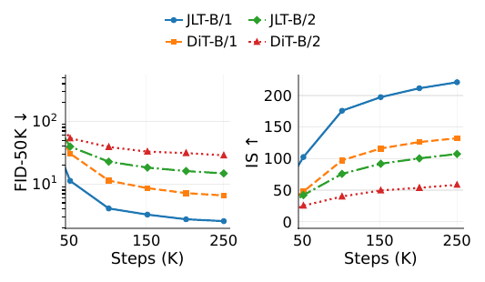

# JLT: Clean-Latent Prediction in Latent Diffusion Transformers

<div align="center">

[](https://arxiv.org/abs/2605.27102)
[](https://github.com/akatsuki-neo/JLT)

</div>

## Overview

<div align="center">

<br><br>
ImageNet 256×256 samples from JLT-B/1 using 50-step Heun sampling.
</div>

## Authors

**Funing Fu**<sup>1,*</sup> · **Tenghui Wang**<sup>2,*</sup> · **Guanyu Zhou**<sup>2</sup> · **Junyong Cen**<sup>1</sup> · **Qichao Zhu**<sup>3</sup>

<sup>1</sup> Independent Researcher · <sup>2</sup> Wuhan University of Technology · <sup>3</sup> Hangzhou Jiyi AI

<sup>*</sup> Equal contribution

## To Do

- [ ] Complete code release (training + evaluation)
- [ ] Release pretrained checkpoints (JLT-B/1, JLT-B/2, DiT-B/1, DiT-B/2)
- [ ] Add FID statistics files for evaluation
- [ ] Provide detailed installation instructions

## Abstract

Flow matching with clean-data prediction has shown that regressing the clean point can exploit low-dimensional structure more effectively than predicting an ambient noised quantity. We ask whether this principle remains useful after images are mapped into a learned latent space, where compression has already removed much of the raw pixel variability. We instantiate this comparison with **JLT**, a controlled 130M latent diffusion Transformer over frozen FLUX.2 VAE codes, and compare clean-latent prediction with a matched velocity-prediction DiT under the same representation, backbone, and training settings. Although $x$, $\epsilon$, and $v$ are linearly convertible for a fixed corruption time, a local Gaussian analysis shows that velocity regression inherits an isotropic target-covariance floor and amplifies low-variance latent directions, while clean prediction damps them. On ImageNet 256×256, **JLT-B/1** obtains **FID-50K 2.50** with classifier-free guidance, with a large matched-target gap over velocity prediction. These results suggest that prediction targets in latent diffusion are representation-dependent geometric choices, rather than interchangeable algebraic parameterizations.

## Method

### Formulation and Prediction Targets

Let $x \in \mathbb{R}^D$ denote the clean latent produced by a fixed encoder, and let $\epsilon \sim \mathcal{N}(0, I)$ denote Gaussian noise in the same coordinate system. We use the linear corruption path:

$$z_t = t \cdot x + (1 - t) \cdot \epsilon, \quad t \in [0, 1]$$

The three common direct targets are:

$$y_x = x, \quad y_\epsilon = \epsilon, \quad y_v = x - \epsilon$$

For fixed $t$, $x$-, $\epsilon$-, and $v$-parameterizations are algebraically equivalent: once a model predicts any one target, the other endpoint variables can be recovered by an affine readout from the predicted target and the known mixture $z_t$.

### Target-Geometry Analysis

**Local linear-Gaussian assumption:** $x \sim \mathcal{N}(0, \Sigma)$ with independent noise $\epsilon \sim \mathcal{N}(0, I)$. The marginal target covariances are:

$$
\text{Cov}(y_x) = \Sigma, \quad \text{Cov}(y_\epsilon) = I, \quad \text{Cov}(y_v) = \Sigma + I
$$

**Key insight:** Velocity prediction adds the same isotropic unit floor to every clean-latent direction. If $\Sigma$ is anisotropic, directions with little clean-data variation become unit-variance directions in $y_v$, while clean prediction keeps their target variance small.

**Conditional ambiguity gap:**

$$\frac{\text{Var}(v_i | z_i)}{\text{Var}(x_i | z_i)} = \frac{1}{(1-t)^2} > 1$$

When $\lambda_i \rightarrow 0$ (low-variance directions):

| Prediction Target | Coefficient Tends To |
|-------------------|---------------------|
| Clean ($x$) | $0$ (attenuated) |
| Velocity ($v$) | $-\frac{1}{1-t}$ (amplified) |

## Architecture

JLT is a Base-scale latent Transformer following JiT-B/16 for architectural comparability:

| Component | Specification |
|-----------|--------------|
| Transformer Blocks | 12 |
| Hidden Dimension | 768 |
| Attention Heads | 12 |
| Bottleneck Patch Embedding | 128-dim |
| Parameters | 130M |
| Tokenizer | FLUX.2 VAE (frozen) |

## Experiments

### Matched Target Ablation

<div align="center">

| Model | Target | Guidance | FID-50K ↓ | IS ↑ |
|-------|--------|----------|-----------|------|
| **JLT-B/1** | $x$ (clean) | w/ CFG | **2.56** | 220.74 |
| DiT-B/1 | $v$ (velocity) | w/ CFG | 6.56 | 132.12 |
| **JLT-B/2** | $x$ (clean) | w/ CFG | **14.81** | 107.29 |
| DiT-B/2 | $v$ (velocity) | w/ CFG | 28.71 | 58.46 |
| **JLT-B/1** (final) | $x$ | w/ CFG | **2.50** | **232.51** |
| JLT-B/1 | $x$ | w/o CFG | 14.00 | -- |

*Matched latent target ablation on ImageNet 256×256. The upper block is the controlled target comparison; the lower block reports the selected final JLT-B/1 evaluation.*

</div>

### Comparison with Representative Baselines

<div align="center">

| Model | Space | Params | Train | FID-50K ↓ | IS ↑ |
|-------|-------|--------|-------|-----------|------|
| **JLT-B/1** | FLUX.2 | 130M | 250K/200ep | **2.50** | **232.51** |
| JiT-L/16 | pixel | 459M | 200ep | 2.79 | -- |
| LDM | latent | -- | -- | 3.60 | -- |
| JiT-B/16 | pixel | 131M | 200ep | 4.37 | -- |

*Guided ImageNet 256×256 comparison with representative baselines.*

</div>

### Training Curves

<div align="center">

<br><br>
Training curves for the matched target ablation. Checkpoints after initialization are evaluated every 40 epochs; clean-latent variants keep lower FID and higher Inception Score than velocity counterparts.
</div>

## Key Findings

1. **Target geometry matters in latent space:** Clean-latent prediction consistently outperforms matched velocity prediction under fixed representation, architecture, and training settings.

2. **Mechanism:** Velocity prediction adds an isotropic covariance floor and amplifies low-variance latent directions, while clean prediction attenuates them.

3. **Representation independence:** The advantage is not a byproduct of using a particular patch size — it holds at both /1 and /2 VAE-grid scales.

## Citation

```bibtex
@misc{fu2026jltcleanlatentpredictionlatent,
      title={JLT: Clean-Latent Prediction in Latent Diffusion Transformers},
      author={Funing Fu and Tenghui Wang and Guanyu Zhou and Junyong Cen and Qichao Zhu},
      year={2026},
      eprint={2605.27102},
      archivePrefix={arXiv},
      primaryClass={cs.CV},
      url={https://arxiv.org/abs/2605.27102},
}
```

## Acknowledgements

- Li & He. "Back to Basics: Let Denoising Generative Models Denoise." arXiv:2511.13720, 2025.
- JiT GitHub: https://github.com/LTH14/JiT
- Black Forest Labs. FLUX.2 Small Decoder. HuggingFace, 2026.